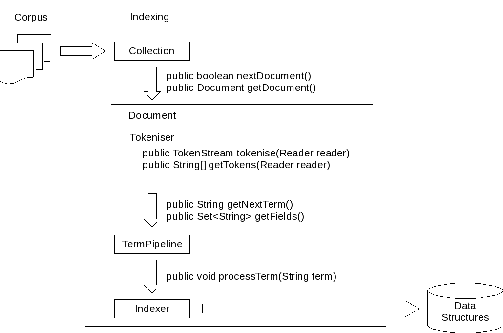
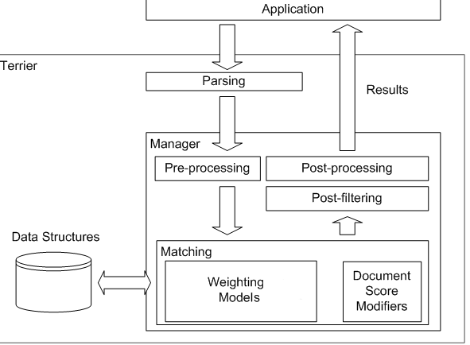

Terrier Components
==================

On this page we will give an overview of Terrier's main components and their interaction.

Modules
-------

Since version 5.0, the Terrier open source project has a number of open source modules:

- retrieval-api - this is the client-side interface for performing querying
- core - this is the main architectural components. All other implementation components depends on core.
- batch-indexers - this is the code for indexing corpora of documents
- batch-retrieval - this is the code of perform batch retrieval experiments
- learning - this extends batch-retrieval with learning-to-rank capabilities
- realtime - this provides incremental and updatable index data structures
- rest-server - this provides a simple RESTful HTTP server that can serve results 
- rest-client - this allows a Manager to be created for an IndexRef that refers to a REST server URL
- website-search - this provides additional web-based interfaces

The components within these various modules interact.

Component Interaction
---------------------

### Indexing

The graphic below gives an overview of the interaction between the main components involved in the indexing process.

-   A corpus will be represented in the form of a [Collection](javadoc/org/terrier/indexing/Collection.html) object. Raw text data will be represented in the form of a [Document](javadoc/org/terrier/indexing/Document.html) object. Document implementations usually are provided with an instance of a [Tokeniser](javadoc/org/terrier/indexing/tokenisation/Tokeniser.html) class that breaks pieces of text into single indexing tokens.

-   The indexer is responsible for managing the indexing process. It iterates over the documents of the collection and sends each term found through a [TermPipeline](javadoc/org/terrier/terms/TermPipeline.html) component.

-   A TermPipeline can transform terms or remove terms that should not be indexed. An example for a TermPipeline chain is `termpipelines=Stopwords,PorterStemmer`, which removes terms from the document using the [Stopwords](javadoc/org/terrier/terms/Stopwords.html) object, and then applies Porter's Stemming algorithm for English to the terms ([PorterStemmer](javadoc/org/terrier/terms/PorterStemmer.html)).

-   Once terms have been processed through the TermPipeline, they are aggregated and the following data structures are created by their corresponding DocumentBuilders: DirectIndex, DocumentIndex, Lexicon, and InvertedIndex.

-   For single-pass indexing, the structures are written in a different order. Inverted file postings are built in memory, and committed to "runs" when memory is exhausted. Once the collection had been indexed, all runs are merged form the inverted index and the lexicon.

Retrieval
---------

The graphic below gives an overview of the interaction of Terrier's components in the retrieval phase.

-   An application, such as for example the Desktop Terrier or TrecTerrier applications, issues a query to the Terrier framework.

-   In a first step the query will be parsed and an instantiation of a Query object will take place.

-   Afterwards, the query will be handed to the Manager component. The manager firstly pre-processes the query, by applying it to the configured TermPipeline.

-   After the Pre-Processing the query will be handed to the Matching component. The Matching component is responsible for initialising the appropriate WeightingModel and DocumentScoreModifiers. Once all these components have been instantiated, the computation of document scores with respect to the query will take place.

-   Afterwards, the PostProcessing and PostFiltering takes place. In PostProcessing, the ResultSet can be altered in any way - for example, QueryExpansion expands the query, and then calls Matching again to generate an improved ranking of documents. PostFiltering is simpler, allowing documents to be either included or excluded - this is ideal for interactive applications where users want to restrict the domain of the documents being retrieved.

-   Finally, the ResultSet (or ScoredDocList) is returned to the client application.

Component description
---------------------

Here we provide a listing and brief description of Terrier's components.

### Indexing

|**Name** | **Description** |
|--|--|
|**Collection** | This component encapsulates the most fundamental concept to indexing with Terrier - a Collection i.e. a set of documents. See [org.terrier.indexing.Collection](javadoc/org/terrier/indexing/Collection.html) for more details.|
|**Document** | This component encapsulates the concept of a document. It is essentially an Iterator over terms in a document. See [org.terrier.indexing.Document](javadoc/org/terrier/indexing/Document.html) for more details.|
|**Tokeniser** | Used by Document objects to break sequences of text (e.g. sentences) into a stream of words to index. See [org.terrier.indexing.tokenisation.Tokeniser](javadoc/org/terrier/indexing/tokenisation/Tokeniser.html) for more details.|
|**TermPipeline** | Models the concept of a component in a pipeline of term processors. Classes that implement this interface could be stemming algorithms, stopwords removers, or acronym expansion just to mention few examples. See [org.terrier.terms.TermPipeline](javadoc/org/terrier/terms/TermPipeline.html) for more details.|
|**Indexer** | The component responsible for managing the indexing process. It instantiates TermPipelines and Builders. See [org.terrier.structures.indexing.Indexer](javadoc/org/terrier/structures/indexing/Indexer.html) for more details.|
|**Builders** | Builders are responsible for writing an index to disk. See [org.terrier.structures.indexing package](javadoc/org/terrier/structures/indexing/package-summary.html) for more details.|

### Data Structures

|**Name** | **Description**
|--|--|
|**BitFile** | A highly compressed I/O layer using gamma and unary encodings. See the org.terrier.compression packages for more details.|
|**Direct Index** | The direct index stores the identifiers of terms that appear in each document and the corresponding frequencies. It is used for automatic query expansion, but can also be used for user profiling activities. See [org.terrier.structures.bit.DirectIndex](javadoc/org/terrier/structures/bit/DirectIndex.html) for more details.|
|**Document Index** | The document index stores information about each document for example the document length and identifier, and a pointer to the corresponding entry in the direct index. See [org.terrier.structures.DocumentIndex](javadoc/org/terrier/structures/DocumentIndex.html) for more details.|
|**Inverted Index** | The inverted index stores the posting lists, i.e. the identifiers of the documents and their corresponding term frequencies. Moreover it is capable of storing the position of terms within a document. See [org.terrier.structures.bit.InvertedIndex](javadoc/org/terrier/structures/bit/InvertedIndex.html) for more details.|
|**Lexicon** | The lexicon stores the collection vocabulary and the corresponding document and term frequencies. See [org.terrier.structures.Lexicon](javadoc/org/terrier/structures/Lexicon.html) for more details.
|**Meta Index** | The Meta Index stores additional (meta) information about each document, for example its unique textual identifier (docno) or URL. See [org.terrier.structures.MetaIndex](javadoc/org/terrier/structures/MetaIndex.html) for more details.|

### Retrieval

**Manager**: This component is responsible for handling/coordinating the main high-level operations of a query. These are:

-   Pre Processing (Term Pipeline, Control finding, term aggregation)

-   Matching

-   Post-processing

-   Post-filtering

See [org.terrier.querying.Manager](javadoc/org/terrier/querying/Manager.html) for more details.

**Matching** The matching component is responsible for determining which documents match a specific query and for scoring documents with respect to a query. See [org.terrier.matching.Matching](javadoc/org/terrier/matching/Matching.html) for more details.

**Query** The query component models a query, that consists of sub-queries and query terms. See [org.terrier.querying.parser.Query](javadoc/org/terrier/querying/parser/Query.html) for more details.

**WeightingModel** The Weighting model represents the retrieval model that is used to weight the terms of a document. See [org.terrier.matching.models.WeightingModel](javadoc/org/terrier/matching/models/WeightingModel.html) for more details.

**Document Score Modifiers** Responsible for query dependent modification document scores. See [org.terrier.matching.dsms package](javadoc/org/terrier/matching/dsms/package-summary.html) for more details.

### Applications

**Name** | **Description**
--|--
**Trec Terrier** | An application that enables indexing and querying of TREC collections. See [org.terrier.applications.TrecTerrier](javadoc/org/terrier/applications/TrecTerrier.html) for more details.
**Desktop Terrier** | An application that allows for indexing and retrieval of local user content. See https://github.com/terrier-org/terrier-desktop for more details.
**HTTP Terrier** | An application that allows for retrieval of documents from a browser. See src/webapps/results.jsp for more details, or the [relevant documentation](terrier_http.html).

----------------------------------
> Webpage: <http://terrier.org>  
> Contact: [School of Computing Science](http://www.dcs.gla.ac.uk/)  
> Copyright (C) 2004-2018 [University of Glasgow](http://www.gla.ac.uk/). All Rights Reserved.
